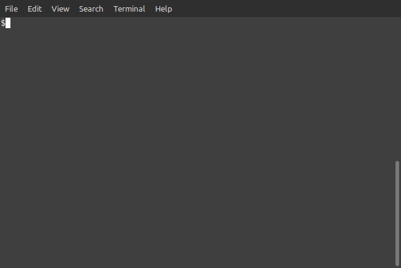

# 🚀🚀🚀 PancakeSwap Mempool SnipeBot 🚀🚀🚀

The most simple, fast and efficient <strong>mempool</strong> sniping bot.  
Currently works with PancakeSwap exchange.

## Prerequisites

1. You need Node.js runtime installed on your computer; get it here - https://nodejs.org/en/download/
2. Clone repository with git or download archive from releases page
3. Open terminal in bot directory and run `npm install` to install all dependencies

## Bot configuration

Open `.env` file in the root directory of the bot. There are a couple of properties that should be set before bot could snipe tokens:

* ✔️ `ACCOUNT_ADDRESS` - public address of your account (wallet); this address is used to buy token
* ✔️ `PRIVATE_KEY` - private key of your account (wallet); key is used to sign and send buy transaction; never share or send this key with anyone!!!
* ✔️ `SNIPE_TOKEN` - the token that you want to snipe
* ✔️ `SNIPE_BNB_AMOUNT` - amount of BNB that you want to spend buying token
* ✔️ `BUY_GAS_LIMIT` - amount of gas allowed to be spent on the buy operation; leave default value (1200000)
* ✔️ `BUY_GAS_PRICE` - amount of gas price for the the buy operation; default value (5) should be OK in most situations; setting higher value may speed up your transaction (but will cost you additional fee)
* ✔️ `WEB_SOCKET_NODE` - this is the most important setting of all: the address of the blockchain node this bot will connect to;  
In order to properly listen for a liquidity, we need to connect via WebSocket protocol  
(instead of a more common HTTP protocol);  
Official Binance WebSocket node is slow and does not work properly, so you need to either:  
find private WebSocket node (this is the best approach; it will cost you small amount of monthly payment)  
launch your own node in the cloud (this is advanced stuff and will cost you a lot of money)  
ask someone to share node with you (free but hard to find)  
Without fast and reliable WebSocket node, this bot CANNOT properly function and will not be able to snipe tokens as fast as possible;  
However, with such node, this bot is fully able to snipe token in the SAME block it is created.  
You can try to order WebSocket node for free at:  
https://moralis.io  
https://www.quicknode.com

If any of these settings is missing - bot won't work.

## Usage

Run bot with `node bot.js` command like in example below ⚙️

_GIF is for the previous version of the bot_  
(I'm too lazy girl to make new one 🤷‍♀️🤷‍♀️🤷‍♀️)

## How it works

When run, bot will constantly scan blockchain memory pool, listening for liquidity added to target token, and when it detects liquidity - it will buy the token, doing it much faster than any human possibly could.

Scanning memory pool - is the <strong>fastest way possible</strong> to detect launch of the token, all other methods are much slower and less reliable.

Pay attentions, this bot works <strong>only</strong> with new tokens; if the token was already launched, the bot won't work.

This bot <strong>does not</strong> sell the token later, sell it manually or wait till I update bot.

## What is the mempool?

Mempool - is the special volatile area of the blockchain where new transactions reside before they are commited into the blockchain. Scanning mempool allows to detect any transaction before it is even finished.  
Check here for more information about mempool - https://coinmarketcap.com/alexandria/glossary/mempool 💪💪💪

In order to work with mempool, the bot has to connect to fast blockchain node via WebSocket protocol;  
If you do not have access to such node, you can still use previous version of the bot, which uses standard HTTP protocol - https://github.com/mrsanna86/pancakeswap-sniping-bot/releases/tag/v1.0.1

## Disclaimer

As with any operation with crypto assets (as with real money in real life), sniping tokens always has financial risks;  
If you run this bot, you take full responsibility of your actions and of your financial success.  
<strong>Always</strong> DYOR (Do Your Own Research) before making any decisions with crypto assets;  
The author of this bot has no responsibility for wrong decisions 🤷‍♀️
Stay safe friends ♥️♥️♥️

## Q&A

* Does this bot work with PancakeSwap? - Currently, it works only with PancakeSwap
* Does this bot work with Uniswap - ^^^
* Can this bot snipe any token? - In theory, yes, but on practice, there are some number of tokens that use anti-snipe mechanisms; this bot can snipe 80-90% of the new tokens (that do not have such mechanisms)
* Ok, how to snipe tokens with anti-snipe mechanisms? - Currently, I'm working on the advanced version of the bot that will defeat any anti-snipe security measures
* Wow, when it will be released? - Can't say for sure, as advanced features require lots of time and lots of testing, but I hope to finish it in the next 2-3 months
* Will advanced bot be posted here on GitHub? - As I told earlier, advanced bot requires <strong>lots</strong> of time, testing and even money (real money) to develop, so the answer is obviously no; I will sell it, but the price will be reasonable
* How can I know that advanced bot is ready? - I will update this readme information when advanced bot will be ready; feel free to ping me if you are interested
* Why you GitHub account is new and has no other projects? - People that launch new tokens are not very happy with snipers and snipe bots (to say at least), so I do not use my real life GitHub account just to ensure my personal safety, I hope you understand it
* Can I modify your bot? - Yes, sure, you can modify and change whatever you want or even build you own bot with features that you want ♥️♥️♥️

## References

* https://docs.binance.org/smart-chain/developer/rpc.html
* https://docs.binance.org/smart-chain/developer/fullnode.html
* https://www.reddit.com/r/pancakeswap/comments/mwz72v/is_there_a_way_to_monitor_the_price_on_pancake/
* https://github.com/religion-counter/onlyone/blob/main/helper-scripts/buy-onlyone-pancakeswap.js
* https://github.com/religion-counter/onlyone/blob/main/helper-scripts/sell-onlyone-pancakeswap.js
* https://stackoverflow.com/questions/66184936/how-to-swap-token-for-eth-with-swapexacttokensforeth-using-uniswapv2router02-c
* https://github.com/Nafidinara/bot-pancakeswap#TROUBLESHOOT
* https://ethereum.stackexchange.com/questions/86511/events-stop-triggering-after-a-while
* Subscribe for pending transactions (mempool):
  * https://chainstack.com/exploring-the-methods-of-looking-into-ethereums-transaction-pool/
  * https://support.chainstack.com/hc/en-us/articles/900003426246-Subscribing-to-global-new-pending-transactions
